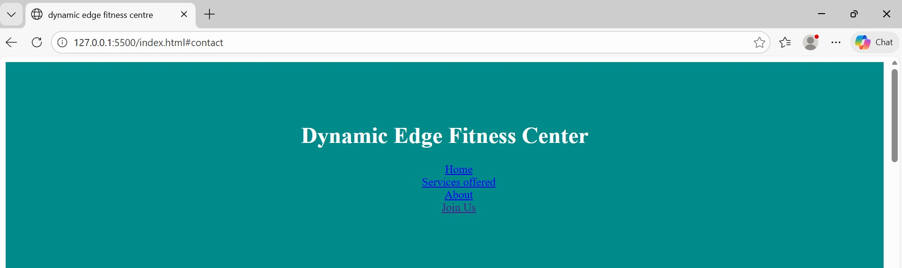

# Dynamic edge fitness centre
## Project overview
This is a responsive landing page for a fictional company by the name dynamic edge fitness center. This project simulates a real client request where you need to deliver a professional web presence with HTML structure and deployment.
# Technologies used
HTML
CSS
GIT
GITHUB
# Business rationale
This landing page objective is to;
Attract new gym members
Communicate core fitness programs
Encourage membership sign-ups
# screenshot

